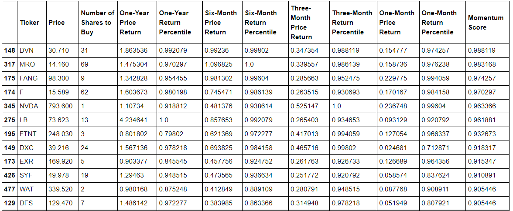

# AlgorithmicTrading
 
 A simple Jupyter NoteBook that calculates the 'Momentum Score' of the stocks in the S&P500 index based on price changes over different time intervals.
 The result ouputs the top 50 stocks based on this score and calculates the amount of each stock to buy based on an evenly distributed portfolio.
 Stock data is gathered from IEX Cloud API.
 
 Sample Output:
 
 
